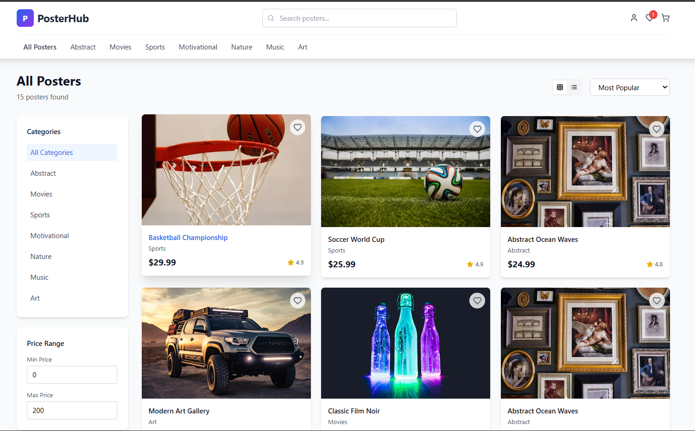

PosterHub 🎨🖼️

An eCommerce website for posters built with React + Vite.
PosterHub allows users to browse, filter, and purchase posters from categories like Abstract, Movies, Sports, Motivational, Nature, Music, and Art.

🚀 Features

🖼️ Browse posters with images, titles, categories, and prices

🔍 Search bar for quick poster lookup

🏷️ Filter by category and price range

⭐ Ratings & popularity sorting

❤️ Wishlist (add to favorites)

🛒 Shopping cart system

📱 Responsive design

🛠️ Tech Stack

Frontend: React, Vite, Tailwind CSS

Icons & UI: Lucide, ShadCN UI components

State Management: React hooks

Routing: React Router DOM

📂 Project Structure
posterhub/
│── public/        # Static assets  
│── src/           
│   ├── components/  # Reusable UI components  
|   |── contexts/    # cart wislist and Authorization
│   ├── pages/       # Page components (Home, Catalog, etc.)  
│   ├── data/        # Poster data (JSON / mock API)  
│   ├── App.jsx      # Main entry point  
│   └── index.jsx    # React DOM rendering  
│── package.json     # Dependencies  
│── vite.config.js   # Vite configuration  

⚡ Getting Started
1. Clone the repo
git clone https://github.com/DeepankSingh/posterhub.git
cd posterhub

2. Install dependencies
npm install

3. Run development server
npm run dev

Visit: http://localhost:5173/

4. Build for production
npm run build
npm run preview

📸 Screenshots

📌 Future Improvements

🔑 User authentication & login

💳 Payment gateway integration

📦 Order management system

🌍 Backend (Spring Boot / Node.js) with database

🤝 Contributing

Pull requests are welcome! For major changes, please open an issue first to discuss what you would like to change.

📜 License

This project is licensed under the MIT License.